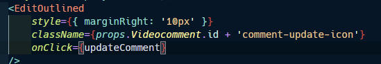

# 예림

공통(Vue),특화(React)를 사용하면서 새로운 Framework를 사용하는데 익숙한 프로젝트를 주로 진행하였다. 하지만 이번 자율은 특화 프로젝트때 사용했던 React를 기반으로 구현하는 것으로 전보다 학습에 힘들 덜 들이고 React 자체에 대해 공부와 CSS에 대한 공부를 심화로 할 수 있는 좋은 시간이었다.


## &#9996;프로젝트 소개

"코딩 스터디 동영상 공유 플랫폼" 으로 취업을 준비하는 취준생 및 대학생을 타겟으로 알고리즘과 CS지식을 동영상으로 제작해 공유하는 플랫폼이다.


- 개발 기간 : 2021/4/12 ~ 2021/5/21 (6주)
- 개발 인원 : Backend(2명) Frontend(3명)

- 맡은 역할 : Frontend


## &#127942;사용한 기술

### Front

- JavaScript
- Reat.js (function형 component 사용, ReactHook사용)
- Git / Gitlab
- JIRA

### Reat 라이브러리

- react-bootstrap

-  react-dom

- react-dropzone

- react-hls

- react-hls-player

- react-infinite-scroll-componen

- react-redux

- react-router-dom

- react-scripts

- react-scroll

- react-slick

- redux

- redux-logge

- redux-persist

- redux-promise

- redux-thunk


## &#9989;내가 맡은 부분

[로그인 및 회원가입 페이지]

- codepen.io를 활용하여 한페이지에 로그인 및 회원가입 완료
- 정규식을 활용하여 이메일 형식 확인
- 이메일을 통해 인증 및 비밀번호 찾기 Modal을 활용하여 구현
- 로그인 동시에 Redux에 회원상태정보 저장
- 비밀번호를 POST할 때 sha256 으로 암호화 하여 전송(이중 보안:프론트 1번 , 백 1번)

[동영상 시청 페이지 : 동영상 상세정보]

- infinite-scroll 를 통해 동영상 별 댓글 보여주기
- 해당 동영상 좋아요, 삭제, 수정 구현
- 댓글 별 작성자만 수정 및 삭제 가능 (동적 클래스 이름 설정)

[동영상 업로드 페이지]

- Grid를 적용하여 반응형 페이지 작성

- FormData를 사용하여 비디오와 이미지 POST로 보내기
- FileReader로 이미지가 성공적으로 drop되면 미리보기 구현
- CCS와 Javascript를 활용하여 알고리즘 및 CS 의 상세 카테고리 선택

[개인 정보 수정 페이지]

- dropzone을 활용하여 이미지 업로드 및 미리보기 구현
- 비밀번호 sha256으로 이중 암호화 적용

[Frontend 개발 초기 세팅]

- ESLint/Prettier를 도입을 통해 Front간 문법 규칙 설정
- HOC를 통해 로그인 여부에 따라 페이지 접근권한 설정
- API 모듈화 (Swagger Controller에 맞춰 API 모듈화 진행)
- JWT토큰이 완료되면 로그인 및 회원가입 페이지로 이동


## &#128518;잘한 점

1. Frontend 리더
   - Frontend 리더 역할로 주도적으로 기술 도입을 제안하였고, Redux를  잘못 이해하고 있던 팀원에게 사용방법과 흐름을 알려주었다. 또한 적극적으로 Backend와 소통하며 필요한 데이터를 요청하고 응답 받으면서 Frontend와 Backend의 노고를 모두 공감하는 개발을 했다고 생각한다.
2. Notion 관리
   - 프로젝트 진행에 문서화도 굉장히 중요하다고 생각한다. 특히 특화 프로젝트에서 문서화를 통해 많은 성장을 이뤘던 경험을 통해 자율프로젝트 팀원에게도 추천및 제안하며 주도적으로 Notion을 관리했다. 
   - 기획, 데일리 스크럼, 스타일 가이드(JIRA,Git,대표 색깔) 등 프로젝트를 구성하는 내용부터 Frontend자료 공간을 통해 개발중 막혔던 부분과 해결했던 내용을 공유하는 공간을 만들어 기능구현에만 초첨을 맞추는 것이 아니라 팀원 모두 지식을 성장 할 수 있게 흐름을 구성하였다.
3. 코드 품질관리
   - 앞의 2개의 프로젝트에서는 계획했던 기능 구현에 많은 시간을 사용해서 작성한 코드를 다시 살펴볼 시간이 부족하였다. 하지만 이번 프로젝트는 기능에 욕심을 내기보다 학습에 초점을 둔 만큼 작서한 코드를 다시 살펴볼 시간이 생겼다. SonarCube를 활용해서 문제를 일으키는 코드를 다시 확인하고 정리하면서 코드를 다시 한번 살펴 볼수 있었다.


## &#128543;아쉬운 점

1. 렌더링의 이해
   1. React의 LifeCycle 메서드를 제대로 이해하지 못한 것 같다. React Hook에는 useState, useEffect말고도 다양하게 존재하는데 2가지 밖에 사용하지 못했다.
2. 비동기/ 동기에 대한 이해
   - 비동기와 동기에 대한 이해가 부족했다고 생각한다. 단순히 개념만 이해하고 왜 async/await를 쓰는지 이해하지 못했다. 그랬기 때문에 useEffect를 사용할 때 하단의 return()에서 값을 읽지 못해 undefined라는 에러가 자주 발생했는데 비동기를 이해하고 렌더링을 생각했다면 오류를 해결하는데 시간을 많이 절약 할 수 있었을 것이라고 생각한다.

3. useEffect deps

   - UseEffect를 단순히 rendering 된 직후 실행하는 용도만 사용했었다. 그러다보니 댓글이 새로 작성됐을 때 자식 컴포넌트에 댓글 배열을 업데이트 시켜주는 데 어려움을 겪었다. deps를 사용하여 의존성 배열을 추가해주는 지식을 터득할 수 있었다.

   - deps에는 여러개의 값이 주어 질 수 있는데 하나라도 변경이 되면 해당 useEffect가 실행된다.

     ```javascript
     useEffect(() => {
         document.title = 'Hello, ' + name; 
     }, [name]); // 우리의 의존성
     ```

   - 단순히 자식에게 props로 값을 내려주는 데 집중하는 것이 아니라 변화와 렌더링의 흐름을 이해해야겠다고 생각했다.
   - 

4. Javascript 안전 연산가
   - 여러계단계로 이루어진 객체를 탐색할 때 || 연산자를 사용하는 경우가 많았다. 하지만 조원의 도움으로 안전 연산자의 존재를 알게 되었다.

## &#9997;코드 기록

### useEffect , 비동기


- 아쉬운 점에서 해결한 코드이다. 초기에 undefined라는 조건을 두지 않아서 에러가 많이 발생했다. 이제는 이해 가능하다...

### File upload & reader


- drop zone에서 한개의 파일을 drop 하게돠면 Formdata에 사용할 파일을 FileArray에 담기도 했지만 Reader를 동시에 활용하여 미리보기 기능을 구현하였다.
- PreviewUrl의 길에 따라 input을 할것인지 img 태그를 보여줄 것인지 코드를 작성하였다.


### 클래스 동적 설정

-  HTML

  

- JavaScript

  

- 해당 comment id에 따라 클래스 명을 설정하고 이벤트에 따라 Class를 가지고 와서 css를 적용시켰다.

### sha256


- 비밀번호 확인 과정을 통과한 경우 sha256을 통해 암호화하였다.

### 토큰 인증 만료


- 토큰의 인증이 만료되면 back에서 "Could not validate credentials" 메시지를 보내준다. 해당 메시지를 받게되면 local storage의 tokem을 지울 뿐 아니라 dispatch를 통해 Redux의 내용도 지워주는 과정을 진행한다.