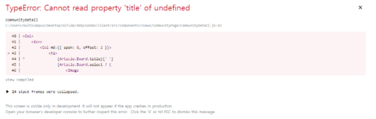

# 노정

## 목차

<ul>
  <h4> INDEX </h4>
  <li>
  	<a href="#만들면서-직면했던-문제들">만들면서 직면했던 문제들</a>
      <ul>
      <li>
  	    <a href="#라우팅-문제-1.-안전-연산자">라우팅 문제 1. 안전 연산자</a>
      </li>
      <li>
  	    <a href="#라우팅-문제-2.-useState와-렌더링">라우팅 문제 2. useState와 렌더링</a>
      </li>
    </ul>
  </li>
  <li>
  	<a href="#폰트적용">폰트적용</a>
  </li>
  <li>
  	<a href="#페이지-라우팅">페이지 라우팅</a>
  </li>
  <li>
  	<a href="#생각해볼것">생각해볼것</a>
      <ul>
      <li>
  	    <a href="#동기/비동기">동기/비동기</a>
      </li>
      <li>
  	    <a href="#컴포넌트 잘짜기">컴포넌트 잘짜기</a>
      </li>      
      <li>
  	    <a href="#Props-vs-Redux">Props vs Redux</a>
      </li>          
    </ul>
  </li>
</ul>


## 만들면서 직면했던 문제들

### 라우팅 문제 1. 안전 연산자

```jsx
const [Article, setArticle] = useState({});

    useEffect(() => {
        detailArticle(num).then(res => {
            setArticle(res.data.data);
        });
    }, []);
```

이렇게 가져와서

```jsx
<h1>
  {Article.Board.title}{' '}
  {Article.Board.select ? (
      <Image
          src={`${process.env.PUBLIC_URL}/img/winner.png`}
          style={{ width: 80, height: 80, float: 'right' }}
          roundedCircle
      ></Image>
  ) : (
      console.log()
  )}
</h1>
```

이렇게 보여주기만 했는데



이렇게 에러가 떴다. 진짜 뭐가 문제인지 몰랐다.


그냥 내생각으론 useEffect부분이 페이지를 펼치기전에 렌더링 되겠지하고 코드를 짰는데 페이지가 먼저 펼쳐지는건가 했다.

구글링하다가 해결방법을 찾았다

https://stackoverflow.com/questions/45422908/cannot-read-property-title-of-undefined-but-title-is-displayed

```jsx
<h1>
  {Article.Board?.title}{' '}
  {Article.Board?.select ? (
      <Image
          src={`${process.env.PUBLIC_URL}/img/winner.png`}
          style={{ width: 80, height: 80, float: 'right' }}
          roundedCircle
      ></Image>
  ) : (
      console.log()
  )}
</h1>
```

문제가 되는 부분에 `?` 연산자를 이용했다

보통 에러없이 `undefined` 띄워주는 용도로 사용했는데

이걸 페이지에 사용하면 해당값이 페이지에 들어올때까지 렌더링을 하지않아서 안전하게 페이지를 구성할 수 있었다.

댓글에

> 안전 연산자는 페이지가 실제로 사용할 수있을 때까지 값을 검색하지 않도록 돕고 오류를 저장하며 경우에 따라 훨씬 더 문제가되는 시나리오를 방지합니다

라고 적혀있더라

이경험으로 도출해낸 결론은 페이지가 구성되는것보다 useEffect로 Mount시 API 통신으로 값을 받아오는것이 더 느릴 수도 있다는 것을 항상 인지하고 안전 연산자를 넣어서 페이지 렌더링을 안전하게 해야겠다는 생각이 들었다.


#### 라우팅 문제 2. useState와 렌더링

React에서 함수형 컴포넌트를 사용할 경우 useEffect로 생애주기를 관리하고 useState로 컴포넌트 내 상태관리를 하게된다.

컴포넌트내에서 바뀐 값은 useState로 관리하게되는데 

보통 

```react
const [Title, setTitle] = useState('');
```

이렇게 선언을하고 값을 바꿀땐

```react
setTitle('안녕하세요')
```

이런식으로 바꿔준다. 

이 setTitle로 Title state를 변경하면 컴포넌트가 다시 렌더링이 된다. 

그래서 동영상 재생페이지에서 댓글을 쓸 경우 재생되던 동영상이 다시 렌더링이 됐었다. 

댓글을 쓸때, state가 변경되면서 같은 컴포넌트에 있던 동영상도 같이 렌더링이 된것이다. 이를 해결하기 위해  

댓글을 하위컴포넌트로 내려서 댓글의 state가 변경되어도 동영상이 다시 렌더링 되지않게했다.


## 폰트적용

웹폰트나 다운받은 폰트를 `index.css`나 `App.css`에 선언하고 적용해주면 된다.


로컬 폰트(다운받은 폰트)일 경우

```css
@font-face {
  font-family: "payboocMedium";
  src: url("./fonts/payboocMedium.ttf");
}
```

웹 폰트일 경우

```css
@font-face {
  font-family: 'twayair';
  src: url('https://cdn.jsdelivr.net/gh/projectnoonnu/noonfonts_tway@1.0/twayair.woff') format('woff');
  font-weight: normal;
  font-style: normal;
}
```

이후 적용할 class의 `font-family`에 넣어주면 된다.

```css
.classCard {
  border: none !important;
  border-radius: 30px !important;
  font-family: "payboocMedium";
}
```


## 페이지 라우팅

react에는 페이지라우팅 방법이 여러가지 있었다.

`<Link>`, `a태그`,`history.push('url')`,`window.location.replace('url')`

각 방법의 차이점을 한번 알아보자

먼저 ,`a태그`와 `<Link>`는 지정한 경로로 바로 이동시켜주는점에서 동일하다

하지만 주로 `a태그`는 외부 사이트로 이동시켜주고 `<Link>`는 프로젝트 내에서 이동한다는점이다. 

또 `history.push('url')`의 경우 조건이 충족되었을때 이동시켜줄수있어 동적으로 제어가 가능하다.

`window.location.replace('url')`는 JavaScript에서 쓰는 방법으로 현재페이지를 `url`페이지로 덮어 씌우는것이다. 따라서 뒤로가기가 불가능하다. 뒤로가기 하려면`window.location.href('url')` 를 쓰자.


그리고 각 방법에따라 값을 넘겨주는 방법도 조금은 다르다.

```react
this.props.history.push({
  pathname: '/template',
  search: '?query=abc',
  state: { detail: response.data }
})
```

```react
<Link to={{
      pathname: '/template',
      search: '?query=abc',
      state: { detail: response.data }
    }}> My Link </Link>
```


## 생각해볼것

### 동기/비동기

> 아침에 일어나서 아침식사를 한다고 가정해보자. 커피를 내리고 식빵을 굽고 베이컨을 구워야한다.
>
> 만약에 커피를 내리고 나서 식빵을 굽고, 식빵을 다 굽고나서 베이컨을 굽는다면 이 방법은 '동기'이다
>
> 반대로 커피를 내리면서 식빵을 굽는다면 이방식은 '비동기'방식이다 -교수님-

일단 axios 요청은 비동기라는것을 알고있어야한다.

```react
fetchAlgorithmTag().then(res => {
    setAlgos(res.data.data);
});
fetchCSTag().then(res => {
    setCss(res.data.data);
});
fetchLanguageTag().then(res => {
    setlanguages(res.data.data);
});
```

각각의 함수는 axios 요청이다.

어떤 응답이 가장 빨리올까? 답은 아무도 모른다. 돌아오는 값의 크기에 따라 다르기 때문이다.

첫번째 axios 요청을 보내고 나서 응답을 기다리는 것이 아니라, 바로 두번째 axios 요청을 보내기 때문이다. 

그래서 axios 요청은 비동기 요청이다. 


나는 이번 프로젝트에서 댓글을 보내고나면 새로운 댓글리스트를 불러오는 방법으로 댓글리스트를 보여줬다.

```react
createComment(body).then(res => {
    setComment('');
    listComment(ArticleId).then(res => {
        setComments(res.data.data);
    });
});
```

이렇게 말이다.

이렇게 짜면 댓글을 작성하고나서 응답이오면 리스트를 불러와서 최신 댓글 리스트를 보여주도록 설계를 해놨다.

그런데 이건 짧아서 다행이지만 콜백지옥을 불러올 수 있는 방법이다. 그래서 비동기 요청들을 동기적으로 실행시켜주는 `async/await`를 활용하여 코드를 짰다면 좀 더  보기 좋게 짰을 것 같다.

```react
async function commentCreateFetch() {
  const body = {
      board_id: ArticleId,
      content: Comment,
  };
  await createComment(body);
  let comments = await listComment(ArticleId);
  setComments(comments)
}

```

이렇게 말이다. 코드 가독성도 엄청 좋아진것같다!

### 컴포넌트 잘짜기

이번에는 컴포넌트 구성에 아쉬움이 남는다. classList는 컴포넌트화를 하지 않았다. community같은 경우는 잘 해놨지만 commentList에서 CRUD를 다 처리해버려서 아쉬움이 남는다. 

아쉬움이 남는 이유는 상태관리, 동작, 렌더링 등등 모든것을 한 컴포넌트에서 실행하니까 코드가독성이 너무 안좋고, 한 컴포넌트에서 너무 많은 것을 실행하고 있다는 생각이 들어서이다. 짤때는 이보다 편할 수 없었지만 죄책감이 드는 코드이다. 

근데 Hooks를 이용하다보니 기능들을 한 컴포넌트에 넣어놓는것이 정말 편하긴했다. 필터링 되는것을 바로바로 페이지에 표현할 수 있었기때문이다. UI적인 부분은 따로 분리해서 재사용할 수 있게 했으면 좋았겠다는건 변함이없다 .

그리고 컴포넌트를 짤 때 '상태변경시에 렌더링되는 컴포넌트의 범위를 잘 생각해서 분리해준다면 페이지를 구성할때 큰 도움이 되는구나' 라는 것을 알게 되었다.


### Props vs Redux

재생목록을 만들면서 Props로 데이터를 2~3단계 내려줬다.

Props로 내려줄지 Redux를 사용하여 관리를 해줄지 많이 고민했었다. 2~3단계쯤 Props를 사용하니 한 페이지 내에서 데이터 이동이지만 너무 많은 것같았고, Redux를 사용하자니 진짜 한 페이지에서만 사용했기때문에 애매했기 때문이다. 

또 찾아보니 

| **Short-term**                                               | **Medium-term:**                                             | **Long-term:**                                               |
| ------------------------------------------------------------ | ------------------------------------------------------------ | ------------------------------------------------------------ |
| 빠르게 변화하는 데이터                                       | 앱 실행동안 유지되는 데이터                                  | 여러 페이지간의 방문, 새로고침 동안 유지되어야 하는 데이터   |
| UI의 텍스트 필드의 문자, 또는 리스트의 아이템을 필터링 하는 것과 같이 빠르게 변화 일어나고 프로젝트의 전반적으로 변화를 주지않는 데이터는 지역 상태(Local State)를 사용하는 것이 유리하다. | API를 통해서 로드된 데이터 나 새로고침 이전까지 유지되어야 하는 데이터로 프로젝트의 전반적으로 영향을 주는 데이터는 Redux Store(State)를 사용하는 것이 유리하다. | 이 경우에는 서버의 데이터 베이스 또는 브라우저의 로컬 스토리지(local storage)에 저장하여 사용한다. |

출처: https://kimch3617.tistory.com/entry/React-Local-State-vs-Redux-StateStore-언제-왜-사용해야-하나 [코드 저장소]


이렇게 나와있다. 

음 전역에서 쓰는 Redux에 추가하는 것은 너무 비효율적인것같다.

대신에 컴포넌트의 Depth를 줄였으면 어떨까싶다. 지금 생각해보면 컴포넌트를 너무 잘게 쪼갰기때문에 Props를 많이 내려줘야했던 것같다. Props를 사용해야하는 컴포넌트의 경우 Depth를 줄여서 Props비용을 줄이는 것도 한 방법인것같다. 


결국 바로 위에 쓴 <컴포넌트 잘짜기>와 이어지는 이야기인것같다. 컴포넌트를 잘짜는 것은 정답이 없는것같다. 

컴포넌트를 쪼개면 가독성이 좋아지고 렌더링도 최적화 될 수 있다. (모든 페이지를 다시 렌더링 안해도 되니까!)

반면에 한 컴포넌트를 쪼개지 않으면 Depth에 따른 Props비용을 절약시켜주는 장점을 가지고있다.  

컴포넌트를 잘 짜는것은 이 두가지 측면을 고려하여 비용을 최소화하는 것이다.

