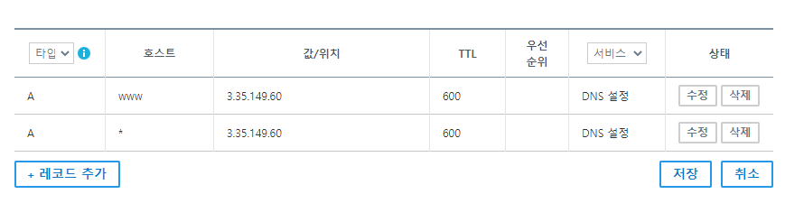
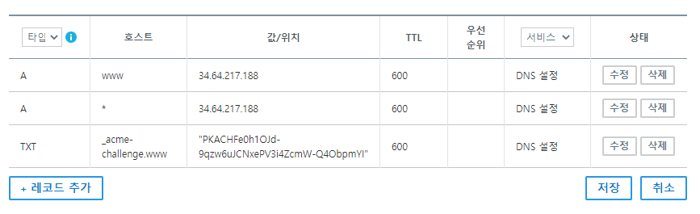
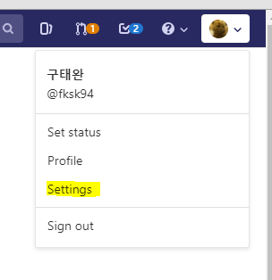
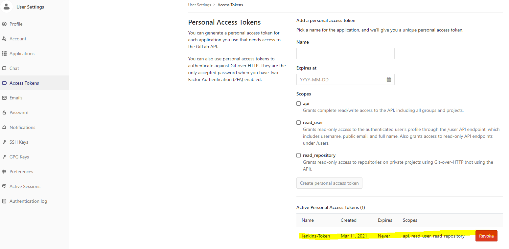
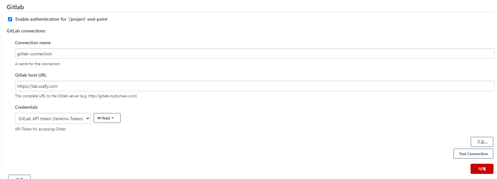
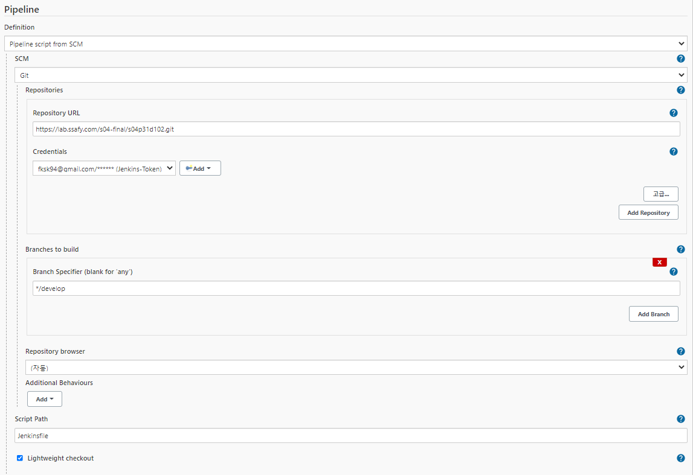
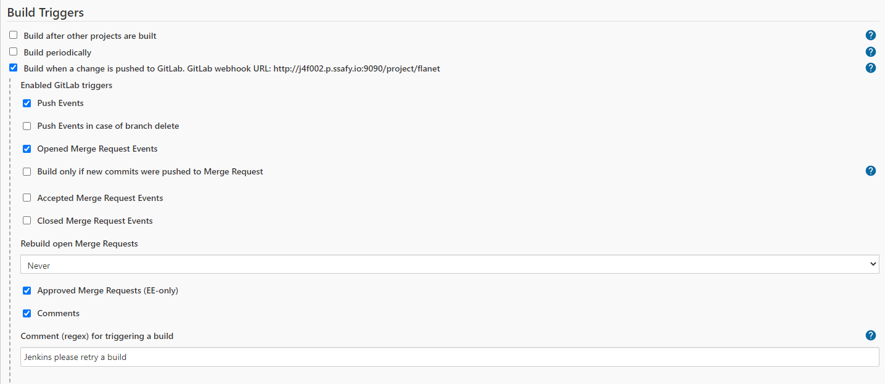
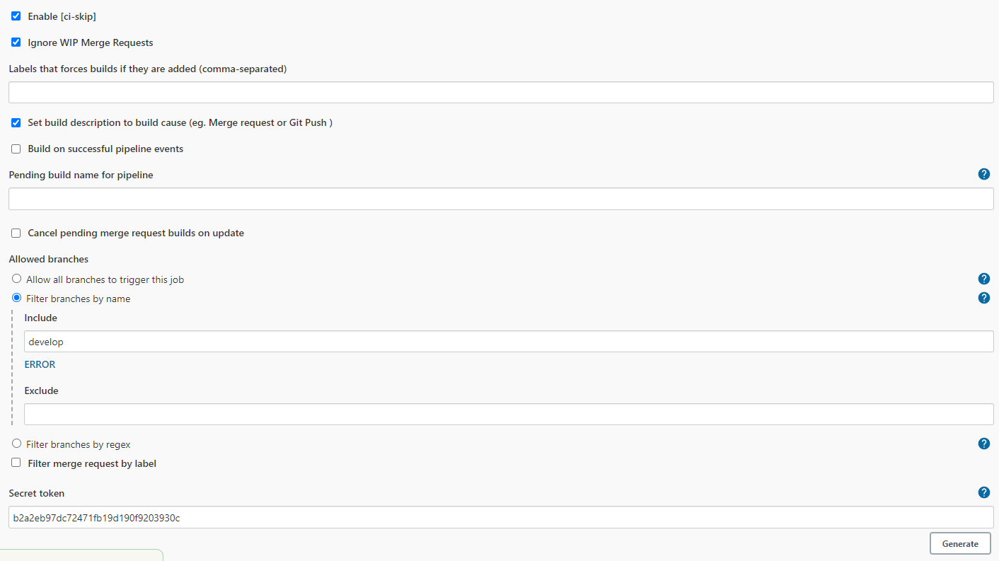
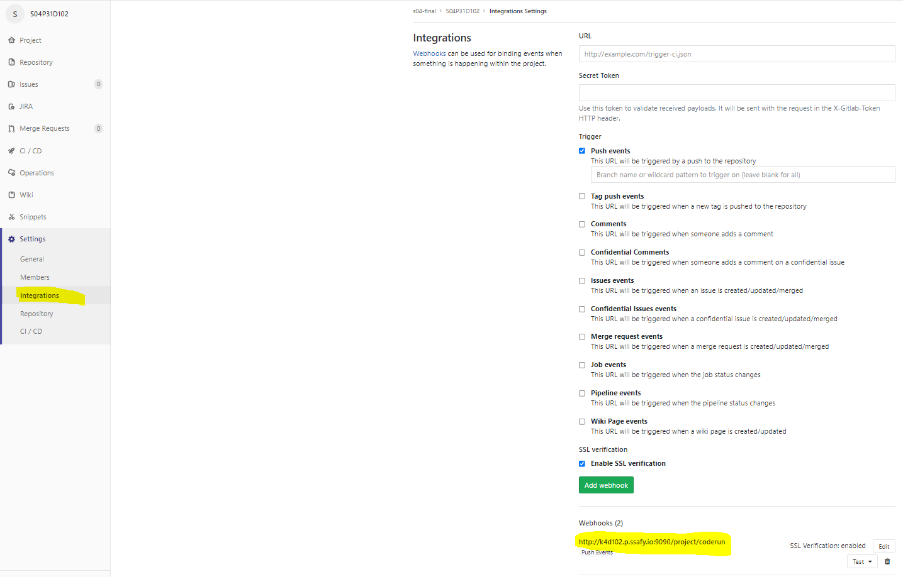

# 배포방법

## 목록

<ul>
    <li><a href="#사전준비">사전준비</a></li>
    <li><a href="#준비하기">준비하기</a></li>
    <li><a href="#실행하기">실행하기</a></li>
    <li><a href="#배포하기">배포하기</a></li>
</ul>


## 사전준비

* AWS EC2 1대
* GCP 쿠버네티스 클러스터 1대
* 도메인 1~2개
* 환경변수파일(이미지, 비디오, 메인 서버 3개)


## 디펜던시

* python 3.8.5
* fastapi 0.63.0
* node.js 14.17.0
* react 17.0.2
* mysql 8.0.24
* Docker 20.10.6
* k8s 1.18.17-gke.100
* k8s-dashboard 2.0.3 
* Jenkins 2.277.3
  * BlueOcean Plugin 1.24.6
  * Gitlab Plugin 1.5.20
  * Gitlab hook Plugin 1.4.2


## 배포하기

### 도메인

* 원하는 도메인을 구매하여 원하는 기업에서 사용하면 됩니다.

* 저희는 가비아를 썼고, 한 도메인으로 호스트를 다르게하여 2개의 IP를 설정할 수 있는지 늦게 알아서 도메인 2개를 썼습니다.

  * 예시) www.코드런.com(AWS), api.코드런.com(GCP)
  * 실제) www.코드런.com(AWS), www.coderun.shop(GCP)

* 로그인 -> 마이페이지 -> DNS 관리 툴 -> 해당 도메인 선택 -> 레코드 수정

  * IP 주소 아는 법

    * 원래 도메인이 설정되어 있다면 ping을 날려본다. - 현재 프로젝트에서 AWS 주소 확인할 때 사용
    * AWS 자체에서 IP를 확인한다.
    * GCP GKE 자체에서 서비스 외부 IP를 확인한다. - 현재 프로젝트에서 GCP 주소 확인할 때 사용

  * www.코드런.com 설정

    

  * www.coderun.shop 설정

    

* TXT 설정 이유는 HTTPS를 인증하기 위해서 입니다.
  * GCP GKE에서 root 계정으로 못 들어가기 때문에 사이트도메인을 TXT 인증으로 SSL 키를 받아야 합니다.
  * TXT 인증 방법은 GCP 배포에서 다시 다루겠습니다.


### AWS

* 리눅스 시간 설정 `sudo timedatectl set-timezone Asia/Seoul`

* 프로젝트 클론: `git clone https://lab.ssafy.com/s04-final/s04p31d102.git`
* 도커 설치 - 현재 최신버전 20.10.6 -> 프로젝트 버전 20.10.6

```bash
# 필수 패키지 설치
sudo apt-get install apt-transport-https ca-certificates curl gnupg-agent software-properties-common
# GPG Key 인증
curl -fsSL https://download.docker.com/linux/ubuntu/gpg | sudo apt-key add -
# docker repository 등록
sudo add-apt-repository "deb [arch=amd64] https://download.docker.com/linux/ubuntu $(lsb_release -cs) stable"
# 도커 설치
sudo apt-get update && sudo apt-get install docker-ce docker-ce-cli containerd.io
# 시스템 부팅시 도커 시작
sudo systemctl enable docker && service docker start
# 도커 확인
sudo service docker status
```

---

* Mysql 컨테이너 가동 - 현재 8.0.25 최신버전 - 프로젝트버전 8.0.24

```bash
# mysql 이미지 불러오기
sudo docker pull mysql:8.0.24
# 도커 이미지 확인
sudo docker images
# 도커 이름은 --name 뒤에 넣고, password는 root 패스워드(사용자 지정)
sudo docker run -d -p 3306:3306 -e MYSQL_ROOT_PASSWORD=yso486 --name mysql mysql
# 도커 컨테이너 bash 접속
sudo docker exec -it mysql bash
# mysql 접속
mysql -u root -p
# 패스워드 입력
yso486
```

* DB 생성 및 사용자 권한 설정

```mysql
# DB 생성
create database coderun;
# 사용자 생성
CREATE USER 'd102'@'%' IDENTIFIED BY 'yso486';
# 사용자 권한 부여
GRANT ALL PRIVILEGES ON *.* TO 'd102'@'%';
# 권한 새로고침 (해야됨)
flush privileges;
```

---

* 젠킨스 docker-compose.yml 작성

```yaml
services:
  jenkins:
    image: 'jenkinsci/blueocean'
    restart: unless-stopped
    user: root
    privileged: true
    ports:
      - '9090:8080'
    volumes:
      - '/home/ubuntu/docker/jenkins-data:/var/jenkins_home'
      - '/var/run/docker.sock:/var/run/docker.sock'
      - '$HOME:/home'
    container_name: 'jenkins'
```

* 도커 컴포즈 설치 및 젠킨스 블루오션 실행 - 도커 컴포즈 현재 최신 버전 1.29.2 - 프로젝트 버전 1.29.1

```bash
# 도커 컴포즈 설치
sudo curl -L https://github.com/docker/compose/releases/download/1.29.1/docker-compose-`uname -s`-`uname -m` -o /usr/local/bin/docker-compose
# 해당 디렉토리에서 도커 컴포즈 업!
sudo docker-compose up -d
# 실행시킨 도커 컨테이너에 접속
sudo docker exec -it jenkins /bin/bash
# 비밀번호 겟해야함. 젠킨스의 초기 비밀번호로 인터넷상에서 들어갈 수 있음.
cat /var/jenkins_home/secrets/initialAdminPassword
# 이 비밀번호로 http://k4d102.p.ssafy.io:9090 들어갈 수 있음.
```

* 웹(http://k4d102.p.ssafy.io:9090)으로 들어가서 권장 설치 선택

* 아이디 비번 만들고, url에서 next!

* 젠킨스로 들어와진다.

* 플러그인에서 Gitlab Plugin / gitlab hook Plugin 설치

* 설치 후 Gitlab 토큰을 얻어야 됩니다.

  * 깃랩에서 오른쪽 프로필 -> 세팅 -> 액세스토큰 -> 3가지 권한다주고 토큰생성

  

  
  * 생성되면 위의 사진 오른쪽 밑 형광색 줄처럼 만들어집니다.
  * 이 토큰 값은 한번밖에 안보여주기 때문에 어디 저장해놓으시면 됩니다.
  * 다시 젠킨스로 돌아가서 토큰 사용 - 2번 사용할 예정

* jenkins 관리 → 시스템 설정에서 gitlab 관련 설정 추가

  * gitlab api token 입력
  * 젠킨스 로케이션 입력

* ID 및 설명에 그냥 gitlab 토큰 이름 썼습니다.(여기는 원하는 것 쓰면 됩니다.)

* test-connection success 쓴다면 굳!

  


* 메인화면에서 새로운 아이템 선택

* 파이프라인 선택

  * Jenkins pipeline 설정 입력
  * 밑에 보면 SCM -> git 선택
  * Repository URL은 Gitlab Repository URL 입력
  * Credentials는 ADD 한 후 Secret Text 타입으로 변경 후 gitlab id와 위에서 발급받은 token 추가
  * script path는 Jenkinsfile이 git상에 존재하는 폴더 위치

  

* 다시 젠킨스 설정으로가서

  * Build when a change is pushed to Gitlab webhook 체크

  

  * Build Triggers 고급... 클릭 후

  * include에서 webhook 브랜치 선택

  * 우측 아래 Generate 클릭 - 키 생성됩니다.

    

* 이제 깃랩의 설정으로 간다.
  * 프로젝트에서 Settings → Integrations 선택
  * URL은 Build Triggers 설정 시 보였던 Gitlab Webhook URL 입력
  * Secret token은 Build Triggers 설정 시 생성했 던 Secret Token 입력
  * add webhook 후, 푸시 이벤츠해보고 success 확인.

  

* 젠킨스 연결 끝!

---

* 도커 네트워크 설정
  * 네트워크 이름  `coderunnet`으로 설정했습니다.
  * `sudo docker network create coderunnet`
* 리눅스의 이미지 서버 폴더에 들어가서 `.env`파일 작성 및 이미지 도커 컨테이너 따로 실행
  * `cd /s04p31d102/server/image`
  * `docker run -d --name imageserver -v /etc/localtime:/etc/localtime:ro --network coderunnet imageserver:latest`
* 젠킨스로 들어가서 `.env`파일 작성 - 이미지 서버와 같이 메인 서버에 작성
  * `sudo docker exec -it jenkins bash`
  * `cd var/jenkins_home/workspace/coderun/server/main`

---

* HTTPS 설정

  ```bash
  sudo apt-get install letsencrypt
  # 인증서 발급
  sudo letsencrypt certonly --standalone -d www.xn--hy1bk2dh74a.com
  # 이메일 쓰고 Agree
  # 뉴스레터 no
  # 이제 인증서가 발급된다. 이 인증서를 잘보관하자
  # 2가지 키가 발급되는데 이 두가지를 써야한다. 밑의 경로에 각각 하나씩 있다.
   ssl_certificate /etc/letsencrypt/live/www.xn--hy1bk2dh74a.com/fullchain.pem; 
   ssl_certificate_key /etc/letsencrypt/live/www.xn--hy1bk2dh74a.com/privkey.pem; 
  ```

* sslkey 폴더 만들고 `cp` 명령어를 통해 복사. 귀찮다고 폴더를 한번에 복사하게 되면 에러가 나거나 심볼릭링크로 가져오니까 조심!!!

  `cp /etc/letsencrypt/live/www.xn--hy1bk2dh74a.com/fullchain.pem /home/ubuntu/sslkey/`

  `cp /etc/letsencrypt/live/www.xn--hy1bk2dh74a.com/privkey.pem /home/ubuntu/sslkey/`

---

* 이제 develop으로 푸시 해보면 됩니다.

* 주의점: 빌드중 누가 푸시를 하게 되면, 즉, 약 3분 사이에 푸시를 2번하게 되면, 에러가 일어나서 충돌함.
  * 충돌 시, 우분투에서 해당 도커 컨테이너 삭제(jenkins 말고 backend, frontend 같은거)하고 이미지 삭제해준 후 다시 트리거 실행시키거나 푸시하면 해결됩니다.
  * 도커 컨테이너 보는 법
    * `sudo docker ps -a`
  * 도커 컨테이너 삭제
    * `sudo docker rm <container_id>`
  * 도커 이미지 보는 법
    * `sudo docker images`
  * 도커 이미지 삭제
    * `sudo docker rmi <image_id>`

### GCP

